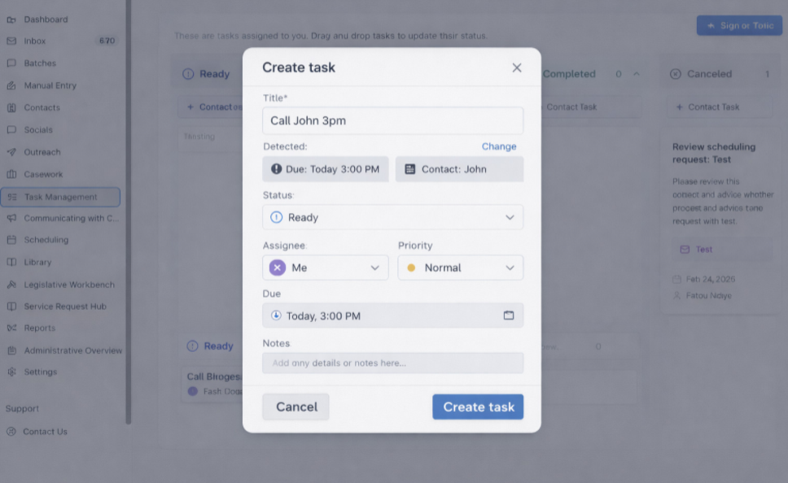
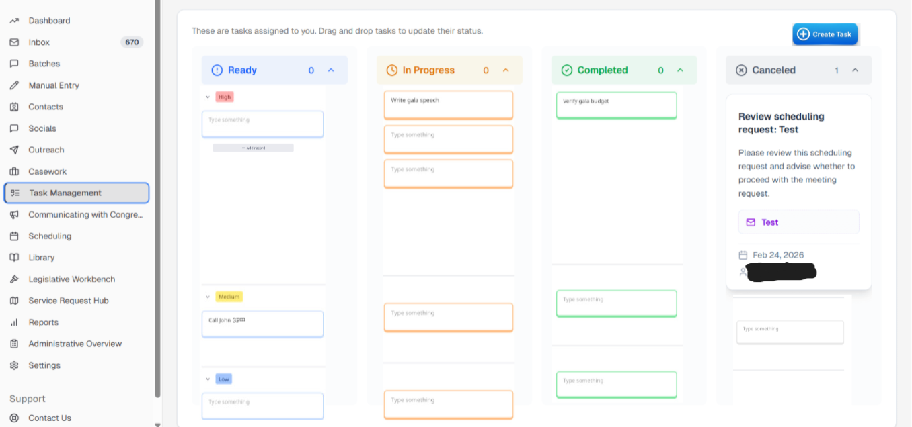

# Civic – Create Task Feature (Product Design)

## Disclaimer

This project showcases a simplified and non-confidential version of product design work. All sensitive or proprietary information has been removed.

## Overview
Designed a task creation workflow for a civic-tech platform used by government officials to manage high-volume constituent communication and casework.

This feature improves efficiency by enabling users to quickly create, assign, and track tasks directly within their workflow.

---

## Problem
Government officials lacked an intuitive way to create and manage tasks within the platform.  

This led to:
- Manual tracking of work
- Slower response times
- Fragmented workflows across tools

---

## Solution
Introduced a **"Create Task" feature** integrated into the task management system.

The solution allows users to:
- Create tasks directly within the platform
- Assign ownership and priority
- Link tasks to relevant contacts
- Track progress through workflow stages

---

## Key Features
- Task creation modal with:
  - Title
  - Due date
  - Assignee
  - Priority
  - Notes
- Contact linking system
- Status tracking (Ready, In Progress, Completed, Canceled)
- Seamless integration into existing task management dashboard

---

## Design Process
- Identified workflow gaps through product analysis and internal feedback
- Defined feature requirements and user flows
- Designed low-to-high fidelity prototypes in Miro
- Translated designs into engineering tickets for implementation

---

## Demo

### Create Task Interface

### Task Management Integration

---

## Impact
- Streamlined task creation within existing workflows
- Reduced friction in managing constituent-related tasks
- Improved clarity in task ownership and prioritization

---

## Tech & Tools
- Miro (wireframing & prototyping)
- Product requirement documentation (PRDs)
- Agile collaboration with engineering

---

## (Optional) Video Demo
[Watch Demo](YOUR_LOOM_LINK_HERE)
